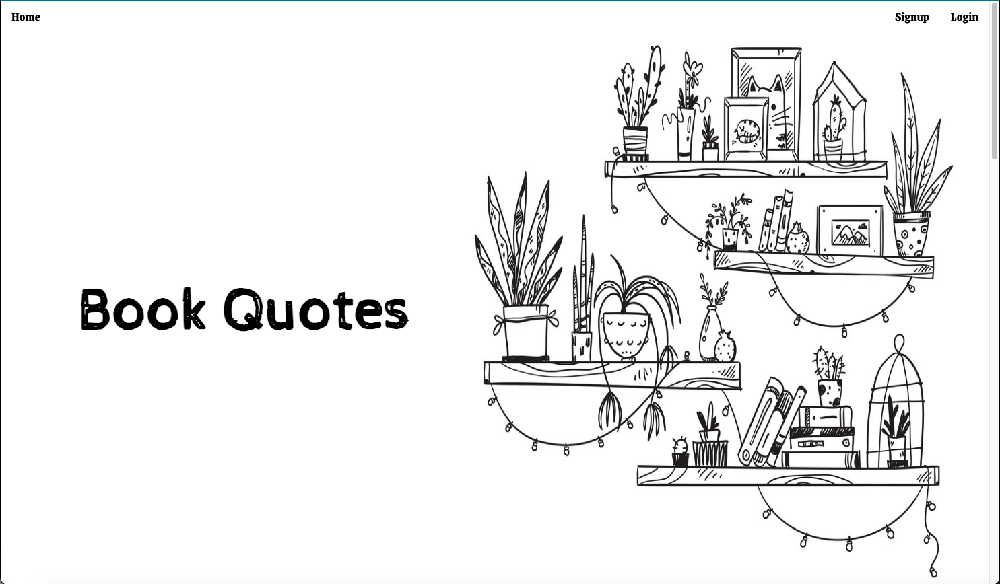
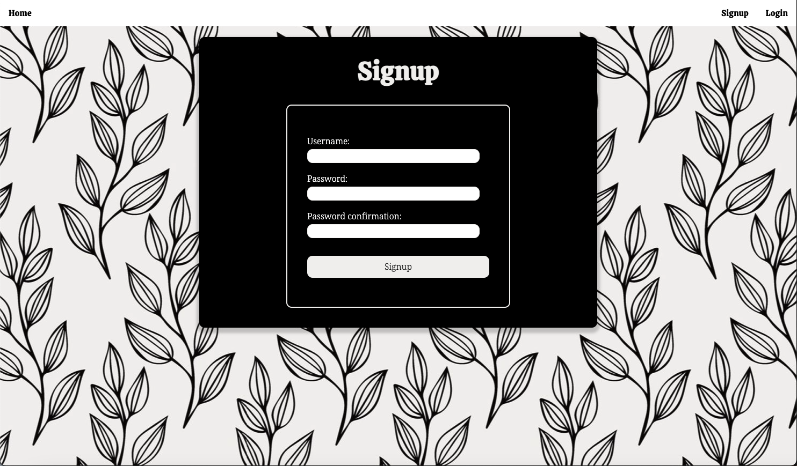
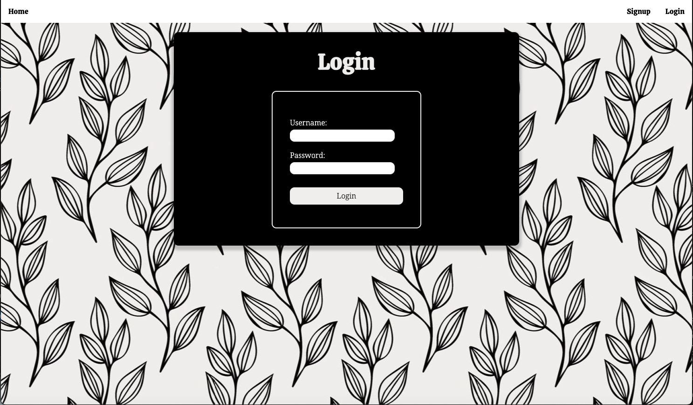
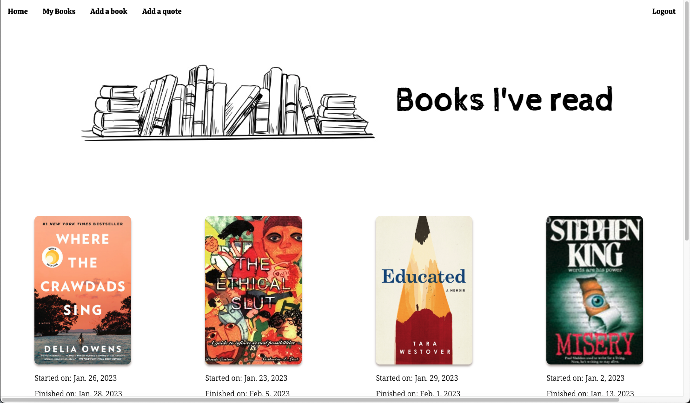
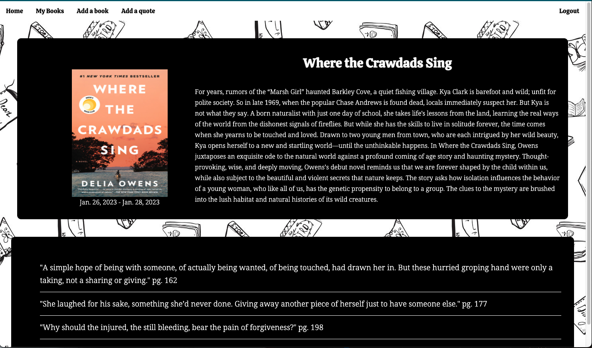
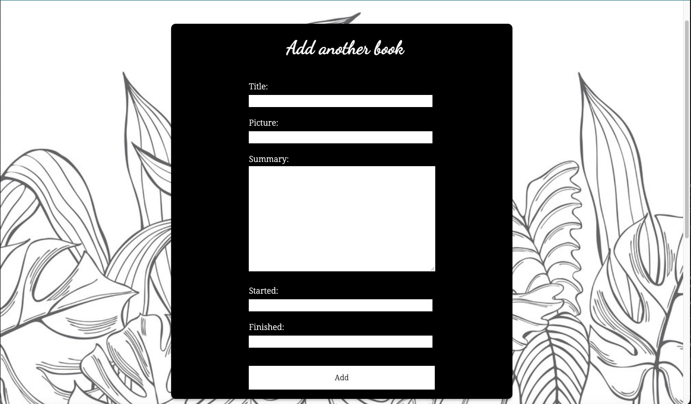
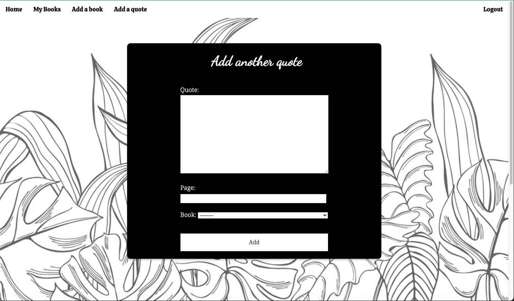

# Books and Quotes

Books and Quotes – giving you the opportunity to add books you've read and saving quotes you liked from those books.


## Intended market
I am targeting people who enjoy reading and want an application that they can keep track of not only the books they've read but any quotes they liked from those books. I am an avid reader and I like to highlight parts or write notes as I read but found most websites only let you track the book itself. So I wanted to create an application that allows me to do both, since some books I rent so I have to return them but I want to be able to have a record of the quotes I liked. So this is for the people facing the same problem as me.

## Functionality
* Users can add books they've read with details such as dates started and finished, a picture of the book, a bio, and the author.
* Users can add quotes from those books they've read including the page number.
* Users can see all their books on one page.
* Users can see a detailed view of each book that has the book information and the quotes.

## Project Initialization
To fully enjoy this application on your local machine, please make sure to follow these steps:
1. Clone the repository down to your local machine
2. CD into the new project directory
3. Run ```python manage.py runserver```
4. Create an account and enjoy the website!

## Application Preview







